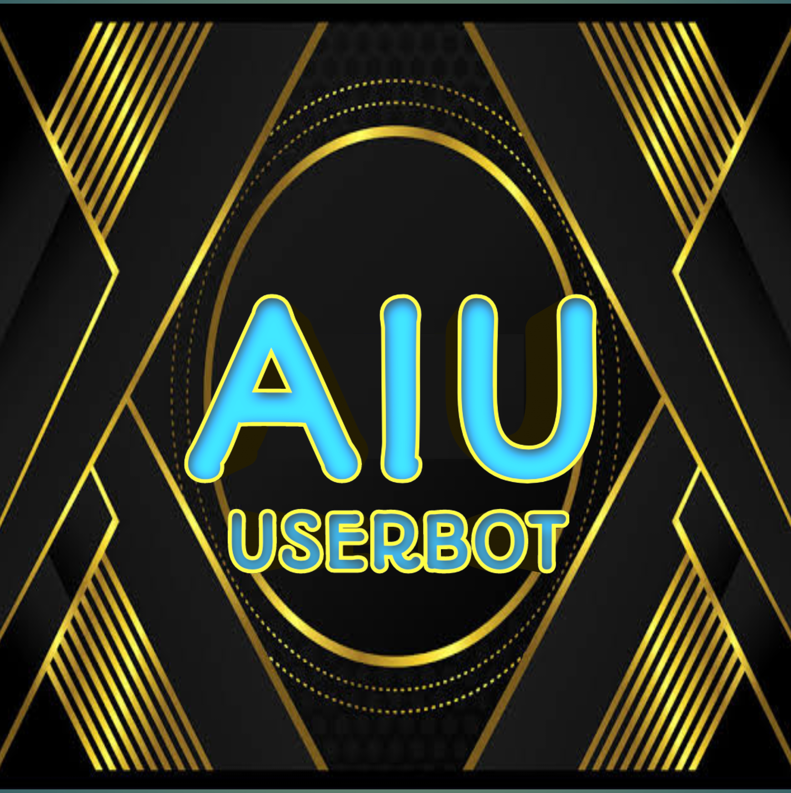

  

<h1 align="center">
  <b>♨️Ultroid - UserBot♨️</b>
</h1>

<b>A stable pluggable Telegram userbot + Voice & Video Call music bot, based on Telethon.</b>

   

   

   

----

♨️ Tutorial to get Redis URL and password - [here.](./resources/extras/redistut.md)
---

<h3 align="center">
    ♨️「 ᴅᴇᴩʟᴏʏ ᴏɴ ʜᴇʀᴏᴋᴜ 」♨️
</h3>

♨️ VPS DEPLOY 
- Get your [Necessary Variables](https://github.com/JIYOXC/Ultroid/blob/main/.env.sample)

- Clone the repository:    

  • `git clone https://github.com/JIYOXC/Ultroid`

- Go to the cloned folder:    

  • `cd Ultroid`

- Create a virtual env:      

  • `virtualenv -p /usr/bin/python3 venv`
    `. ./venv/bin/activate`

- Install the requirements:

  • `pip3 install --no-cache-dir -r re*/st*/op*.txt`

  • `pip3 install --no-cache-dir  -r requirements.txt`

- Fill your variables in the env by

  • `nano .env` 

  If you have finished edit, CTRL S + CTRL X.

• Install screen to keep running your bot when you close the terminal by 
  
  • `SCREEN -S Ultroid`

• Finally Run the bot:
  
  • `bash startup`

• For getting out from screen session press    
• `Ctrl+a and Ctrl+d`

---
♨️ Termux Session Gen

`apt update && apt upgrade -y && apt install python wget -y && pip install Telethon && wget https://raw.githubusercontent.com/TeamUltroid/Ultroid/dev/resources/session/ssgen.py && python ssgen.py`

---

# License
   
Ultroid is licensed under [GNU Affero General Public License](https://www.gnu.org/licenses/agpl-3.0.en.html) v3 or later.

---

# Credits
* 
* [Lonami](https://github.com/LonamiWebs/) for [Telethon.](https://github.com/LonamiWebs/Telethon)
* [MarshalX](https://github.com/MarshalX) for [PyTgCalls.](https://github.com/MarshalX/tgcalls)

> Made with 💕 by [@TeamUltroid](https://t.me/TeamUltroid).    
